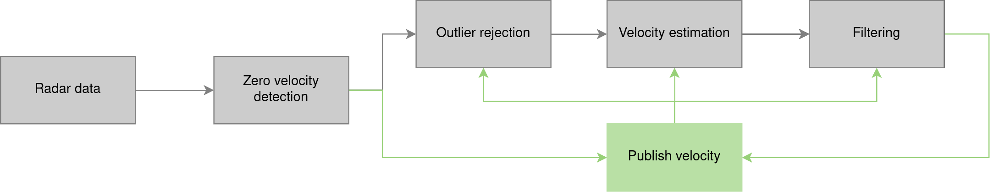

# RAVE package
The radar ego-velocity estimation ROS package


RAVE is  a framework for ego-velocity estimation that relies on 3D automotive radar data and encompasses zero velocity detection, outlier rejection, and velocity estimation.


The figure below representes the proposed RAVE framework pipeline scheme. Through our filtering method we determine the feasibility of the estimated velocity. The accepted values serve as inputs for the next step, while rejected values are discarded.




## Outlier Rejection Methods
- **MLESAC**
- **RANSAC**
- **GNC**

## Inlier Estimation Methods
- **LS**
- **TLS**
- **WTLS**
- **Cauchy robust loss**
- **Huber robust loss**

and many more. 

All parameters can be set in params.yaml 

## Currently in progress:
- **covariance estimation for all algorithms**


# Package setup

This repository contains a Dockerfile and a `docker-compose.yaml` configuration to set up and run a ROS1 Noetic environment with a custom catkin workspace with RAVE. The setup includes copying the `rave` folder into the Docker container and building the workspace.

## Prerequisites

Before you begin, ensure that you have the following software installed on your host machine:

- Docker: [Install Docker](https://docs.docker.com/get-docker/)
- Docker Compose: [Install Docker Compose](https://docs.docker.com/compose/install/)


## Project Structure

Make sure your project directory has the following structure:

```
/your-project-directory/
│
├── Dockerfile
├── docker-compose.yaml
├── rave/                   # The rave folder to be copied into the container
└── README.md
└── LICENSE.md
```

- `Dockerfile`: Contains the instructions to build the Docker image.
- `docker-compose.yaml`: Configuration file to define and run the Docker container.
- `rave/`: The ROS package to be copied into the container's workspace.


# Testing RAVE

## Prerequisites
- **Download the [IRS](https://christopherdoer.github.io/datasets/irs_rtvi_datasets_iros2021) dataset**
- **Modify the dataset path in `docker-compose.yaml` file**


## Building and running the Docker Image

To build the Docker image, follow these steps:

1. Navigate to the directory containing the `Dockerfile` and `docker-compose.yaml` files.

2. Build the Docker image using the following command:

   ```bash
   docker compose build
   ```

This command will create a Docker image based on the `Dockerfile` and prepare the environment by copying the `rave` folder into the container.


Once the image is built, you can run the container using Docker Compose:

3. Start the container with the following command:

   ```bash
   docker compose up
   ```

   This command will start the container in interactive mode, and the ROS environment will be set up, including the sourcing of the catkin workspace.

4. Access the running container in a new terminal:

   ```bash
   docker exec -it noetic_rave /bin/bash
   ```

   This command will give you access to a bash shell inside the running container.

## Testing RAVE


   You can now run RAVE test launch file using mocap_easy sequence:

   ```bash
   roslaunch rave test.launch
   ```


## Citation
If you find this work beneficial to your academic research, we would greatly appreciate it if you could reference our paper in your citations.
```bibtex
@article{vstironja2024rave,
  title={RAVE: A Framework for Radar Ego-Velocity Estimation},
  author={{\v{S}}tironja, Vlaho-Josip and Petrovi{\'c}, Luka and Per{\v{s}}i{\'c}, Juraj and Markovi{\'c}, Ivan and Petrovi{\'c}, Ivan},
  journal={arXiv preprint arXiv:2406.18850},
  year={2024}
} 
}
```


## Acknowledgement
This research has been supported by the European Regional Development Fund under the grant PK.1.1.02.0008 (DATACROSS).

We thank the authors of the [reve](https://github.com/christopherdoer/reve) and [goggles](https://github.com/cstahoviak/goggles) open-source packages.


